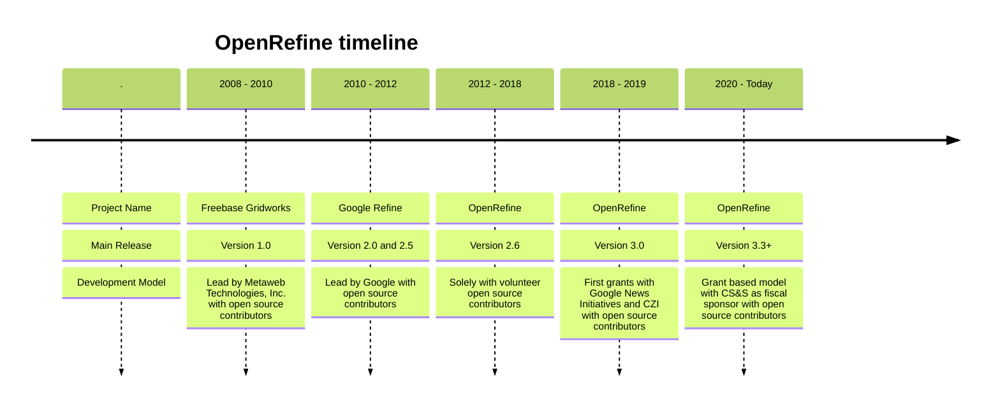

title: OpenRefine プロジェクトの歩み
description: OpenRefine の歴史を簡単に紹介します
hide_table_of_contents: false
---
# OpenRefine の歴史 

この 10 年あまりで OpenRefine は名称や開発体制を含む大きな変化を経験しました。企業主導のオープンソースから、コミュニティ主導・助成金併用のモデルへと移行しています。

## 2008 - 2010: Freebase Gridworks

OpenRefine の源流は 2010 年 5 月、Metaweb Technologies, Inc. がオープンソースのデータクレンジングツール「Freebase Gridworks」の開発を始めたことにあります。David Huynh によって考案されたこのツールは、大規模な共同知識ベース Freebase へインポートするためのデータ整形を簡素化し、大量データの編集やリコンシリエーション用 UI を提供しました。

## 2010 - 2012: Google Refine

2010 年 7 月、Google が Metaweb Technologies を買収し、Freebase Gridworks も Google の手に渡りました。この後「Google Refine」と改名され、Google のもとでデータクレンジング機能を強化したバージョン 2.0 が公開されました。Google Refine は散らかったデータの整備、形式変換、Web サービスによるデータ拡張など多様な用途で評価されました。

## 2012 - 2019: OpenRefine

2012 年、Google はプロジェクトの主導権をオープンソースコミュニティへ移し、名称を「OpenRefine」に変更して GitHub へ移管しました。それ以降、科学者・研究者・ジャーナリスト・セマンティックウェブ実践者・図書館や文化遺産の専門家など、多様なユーザーに広がっていきました。

2017 年には Wikidata のリコンシリエーションエンドポイントと Wikimedia プロジェクトへの投稿プロセスが整い、OpenRefine との連携が始まりました。

2018 年 12 月には Google News Initiative から 100,000 ドルの寄付を受け、ロゴも刷新されました。

## 2019 - today: OpenRefine, part of Code for Science & Society

その後は Chan Zuckerberg Initiative、Wikimedia Foundation、NFDI などから継続的に助成を受けることで、助成金を軸としたサステナブルなモデルを確立しました。資金管理を円滑にするため、2020 年には米国の非営利法人 Code for Science and Society (CS&S) の財務スポンサーシップを受けるプロジェクトとなりました。

この期間に OpenRefine は飛躍的な成長を遂げ、アクティブな貢献者（有償・無償）の数が倍増し、対応言語が増え、Wikimedia Commons や Wikibase とのネイティブ連携が追加され、多くのユーザーに頼られる存在になりました。さらにアドバイザリー委員会の設置や Google Summer of Code・Outreachy などのインターンシップへの参加を通じて、組織面でも整備が進みました。
