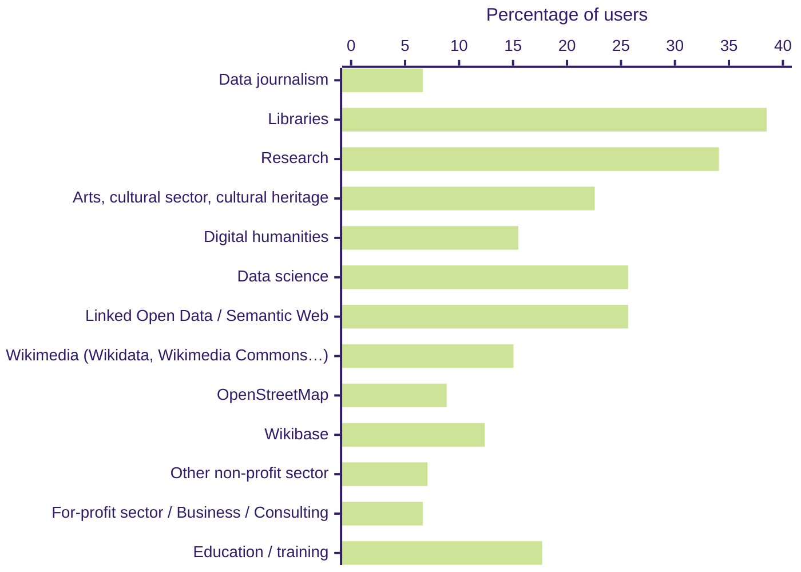
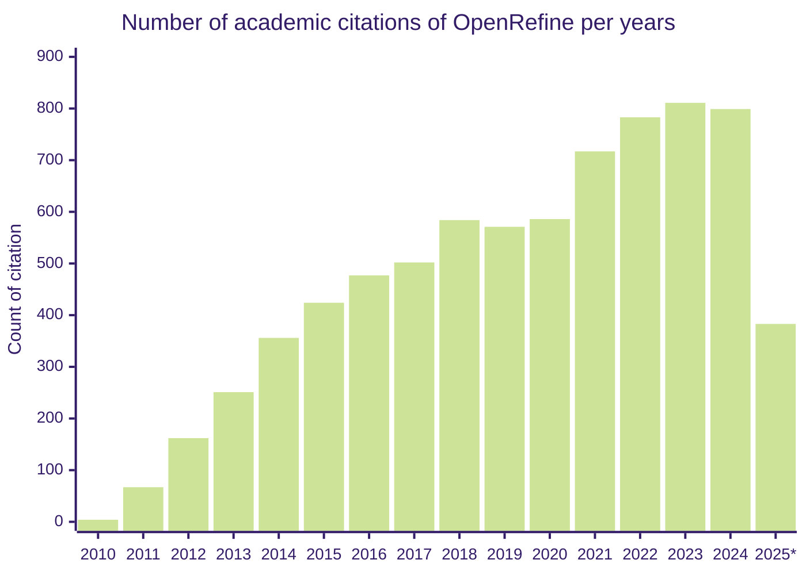
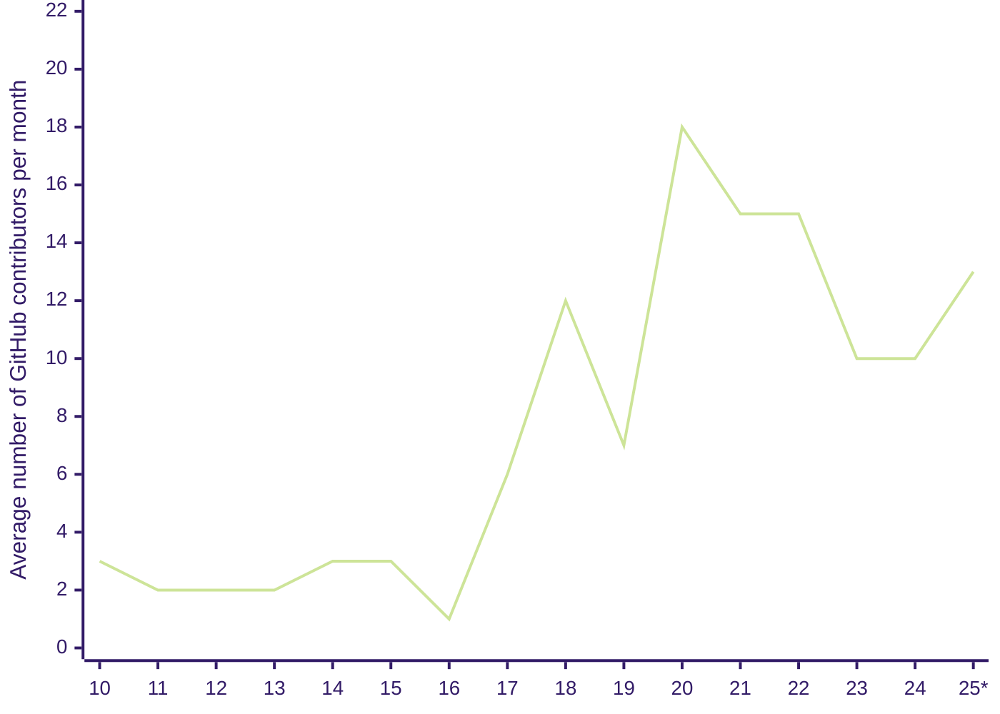

title: OpenRefine の利用例
description: OpenRefine を利用している人たち
hide_table_of_contents: false
---
# OpenRefine の利用状況 

OpenRefine は散らかったデータを整え、形式を変換し、外部サービスやデータと連携させるための無償オープンソースツールです。プログラミングやクエリ言語の知識がなくても、インタラクティブに不整合を見つけて修正したり、外部データベースと照合したり、追加データを取得したりできます。作成したワークフローは抽出して別のデータセットにも適用できます。

**月平均 15,500 回ダウンロードされ、学術論文では年間約 800 件引用されています。**

## ユーザーコミュニティ

使いやすさと柔軟性から、多様なコミュニティや業界で活用されています。
1. **ジャーナリスト・メディア**: 調査報道や分析、可視化に向けてデータを整備。
2. **GLAM（美術館・図書館・公文書館・博物館）**: 作品や文化遺産のカタログ情報をクレンジングし、品質を高めます。
3. **ウィキペディアン／ウィキメディア貢献者**: Wikidata や Wikimedia Commons などの構造化データを管理・改善するための定番ツール。
4. **研究者**: 社会科学・自然科学・医療分野など幅広い研究データの整形に利用。
5. **データアナリスト／データサイエンティスト**: 解析前の前処理やクレンジングでデータ品質を確保。
6. **教育者・トレーナー**: カリキュラムやワークショップに組み込み、データ整形のスキルを教える用途で活躍。

以下の図は [2024 年のユーザー調査](/blog/2024/12/20/2024-survey-results) で回答者が所属を感じているコミュニティを示したものです（複数回答あり）。

## 学術論文での引用 
OpenRefine は研究にも幅広く活用され、論文でも引用されています。引用する際は [Zenodo DOI-10.5281](https://zenodo.org/records/10689569) をご利用ください。下記グラフは Google Scholar で次の語句を検索した結果から、年ごとの引用件数をまとめたものです。
* [Google Refine](https://scholar.google.ca/scholar?hl=en&as_sdt=0%2C5&as_ylo=2023&as_yhi=2023&q=%22Google+Refine%22+-openrefine&btnG=)
* [Open Refine](https://scholar.google.ca/scholar?hl=en&as_sdt=0%2C5&as_ylo=2023&as_yhi=2023&q=%22Open+Refine%22+-openrefine&btnG=)
* [OpenRefine](https://scholar.google.ca/scholar?hl=en&as_sdt=0%2C5&as_ylo=2023&as_yhi=2023&q=%22OpenRefine%22&btnG=)

（*）2025 年の値は 2024 年 7 月 15 日時点までの集計です。

## フォーラム統計 

2022 年 11 月、Google グループのメーリングリストから Discourse フォーラムへ移行しました。

2025 年 7 月 15 日時点の直近 12 か月では:
* 新規登録 265 名[^1]、累計ユーザー 720 名[^2]
* 278 件のトピック[^3]、メッセージ 1,522 件[^4]

## コントリビューション統計

以下はメインの GitHub リポジトリ（コード・デザイン・翻訳）での活動状況です。ドキュメントは別リポジトリで管理しています。

2025 年 7 月 15 日時点の直近 12 か月では:
* アクティブな GitHub コントリビューター 22 人
* Issue は [163 件作成](https://github.com/OpenRefine/OpenRefine/issues?q=is%3Aissue%20created%3A2024-07-15..2025-07-15)、[157 件クローズ](https://github.com/OpenRefine/OpenRefine/issues?q=is%3Aissue%20closed%3A2024-07-15..2025-07-15)
* [マージされた PR 212 件](https://github.com/OpenRefine/OpenRefine/pulls?q=is%3Amerged+created%3A2024-07-15..2025-07-15+-author%3Aapp%2Fdependabot)（dependabot 由来を除く）

下図はメインリポジトリの年間平均アクティブ貢献者数[^5]です。リアルタイムの活動状況は [GitHub Pulse](https://github.com/OpenRefine/OpenRefine/pulse) や [GitHub Traffic](https://github.com/OpenRefine/OpenRefine/graphs/traffic) でも確認できます。

（*）2025 年の値は 2025 年 7 月 15 日までの集計です。
[^1]: [Discourse 管理画面の Signups](https://forum.openrefine.org/admin/reports/signups?end_date=2024-12-03&mode=table&start_date=2023-12-03)
[^2]: [ユーザー一覧](https://forum.openrefine.org/u?order=likes_received&period=all) の人数
[^3]: [Topics レポート](https://forum.openrefine.org/admin/reports/topics?end_date=2024-12-03&mode=table&start_date=2023-12-03)
[^4]: [Posts レポート](https://forum.openrefine.org/admin/reports/posts?end_date=2024-12-03&mode=table&start_date=2023-12-03)
[^5]: `git log --all --pretty="%an" | sort | uniq | wc -l` で算出
